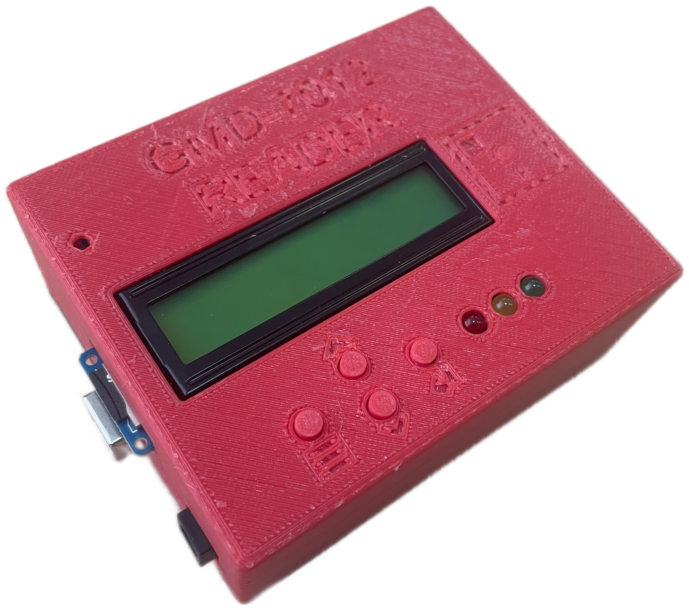
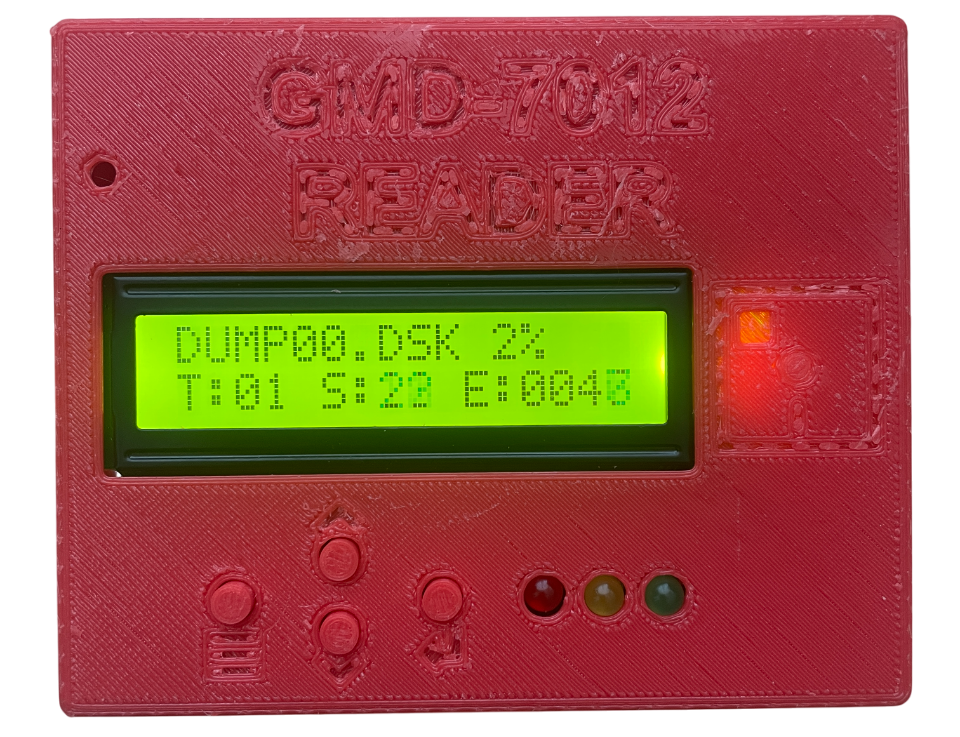

# Считыватель для накопителя "ГМД-7012" (далее `READER`) #

## Описание ##

Устройство позволяет снимать образы 8-ми дюймовых дискет от накопителя "ГМД-7012" на MicroSD карту.  Представляет собой шилд (плату расширения) для Arduino Mega 2560 с кнопками, дисплеем и MicroSD адаптером.

## Сборка ##

Сборка устройства подробно описана в [ASSEMBLY.md](doc/ASSEMBLY.md) в папке *doc*.

## Питание устройства ##

* **USB Type-B**
Разъём USB Type-B предназначен для прошивки и питания платформы Arduino Mega 2560 по USB. Для коммуникации понадобится кабель USB Type-B.
* **DC Jack**
Коннектор DC Jack служит для подключения внешнего источника напряжения в диапазоне от 7 до 12 вольт. Например блок питания на 9В или 12В. Размер штекера 5.5*2.1 мм. Полярность: внутренний "+", внешний "-".  
Рекомендуется использовать блок питания 9В/2A.

Оба разъема расположены на левой стороне устройства.

## MicroSD карта ##

Поддерживаемый объем MicroSD: до 2 Гб  
Поддерживаемый объем MicroSDHC: до 32 Гб  
Карта должна иметь файловую систему FAT32.  

Опробовано с картой памяти MicroSDHC Class 10 объемом 8GB.

`Установка и извлечения карты памяти проводится только на отключенном от питания устройстве.`  
Если карта не установлена, то при подаче питания на устройство на дисплее будет отображаться *"SD CARD ERROR!"*.  
Если устройство зависает на экране вывода названия и версии ПО, попробуйте заново отформатировать карту.`

Разъем расположен с левой стороны устройства.

## Клавиши управления ##

На лицевой панели находятся 4 кнопки управления с помощью которых осуществляется навигация.  
* 1 = Меню  
* 2 = Вверх  
* 3 = Вниз  
* 4 = Enter

<!-- ## Индикация ##

"Красный" -   
"Желтый" -  
"Зеленый" - 
-->

## Использование ##

Для снятия образов дискет вам потребуется "НГМД-7012" и собственно сам `READER`. От того, в каком состоянии (насколько хорошо читает дискеты) находится "НГМД-7012" напрямую зависит качество создаваемых образов.

Процесс происходит следующим образом:
* Подключить кабель управления от "НГМД-7012" к `READER`;
* Установить MicroSD карту в слот, если она не установлена;
* Подать питание на `READER`;  
* Подать питание на накопитель "ГМД-7012";
* Дождаться отображения заставки с версией ПО, после чего прозвучит звуковой сигнал и на экране отобразиться меню;
* Вставить дискету в накопитель;
* С помощью клавиш "Вверх", "Вниз" выбрать нужный пункт "DUMP [0]" или "DUMP [1]" в зависимости от того с какого привода следует произвести считывание образа. [0] - левый ; [1] - правый
* Дождаться когда процесс завершиться. На экране появится надпись "DONE" и прозвучит звуковой сигнал. После нажатия любой кнопки появится начальное меню с выбором с какого привода снять образ.

## Экран процесса снятия дампа ##

* *"DUMP00.DSK"* - Имя записываемого файла
* *"2%"* - Процент выполнения
* *"T:01"* - Текущая дорожка
* *"S:22"* - Текущий сектор
* *"E:043"* - Количество ошибок чтения

## Работа с образами дискет (дампами) ##

* Полученный образ можно скопировать на ПК используя кард-ридер. 
* Использовать в [Эмуляторе "НГМД-7012"](https://github.com/v8355800/rx02_emulator).

При создании дампа дискеты на флешке будет создан файл *DUMPXX.DSK (где XX - 00 до 99)*.Если во время считывания дискеты появлялись ошибки чтения секторов, то будет выполнено 5 попыток повторного чтения, если и после этого считать сектор не удалось, то в образ на место данного сектора будут записаны 00. В случае ошибок чтения помимо файла *DUMPXX.DSK* будет создан второй файл *DUMPXX.DSK_meta* в который будет помещен подробный лог по ошибкам чтения. Данный файл носит справочный характер, при переносе дампа на *ЭМУЛЯТОР* его копировать не нужно.

При хранение дампов на ПК их можно переименовывать как угодно, но при переносе на *ЭМУЛЯТОР* не стоит превышать 6 символов в имени, иначе на LCD дисплее они будут отображаться некорректно. Так что можно хранить на ПК под одним именем, а при переносе просто переименовывать копию.
