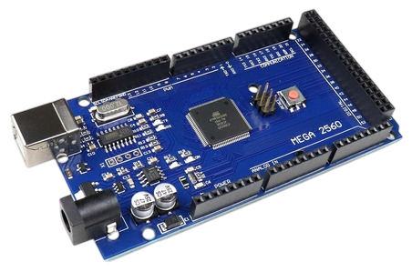
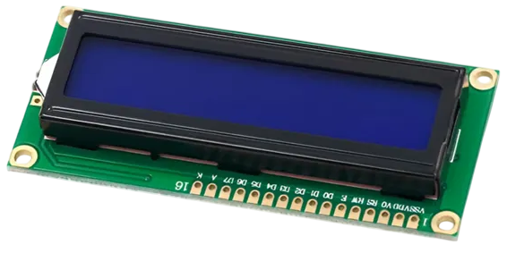
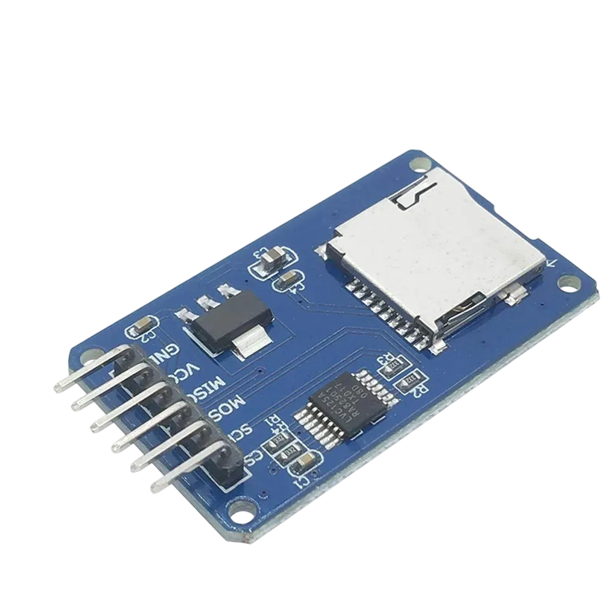
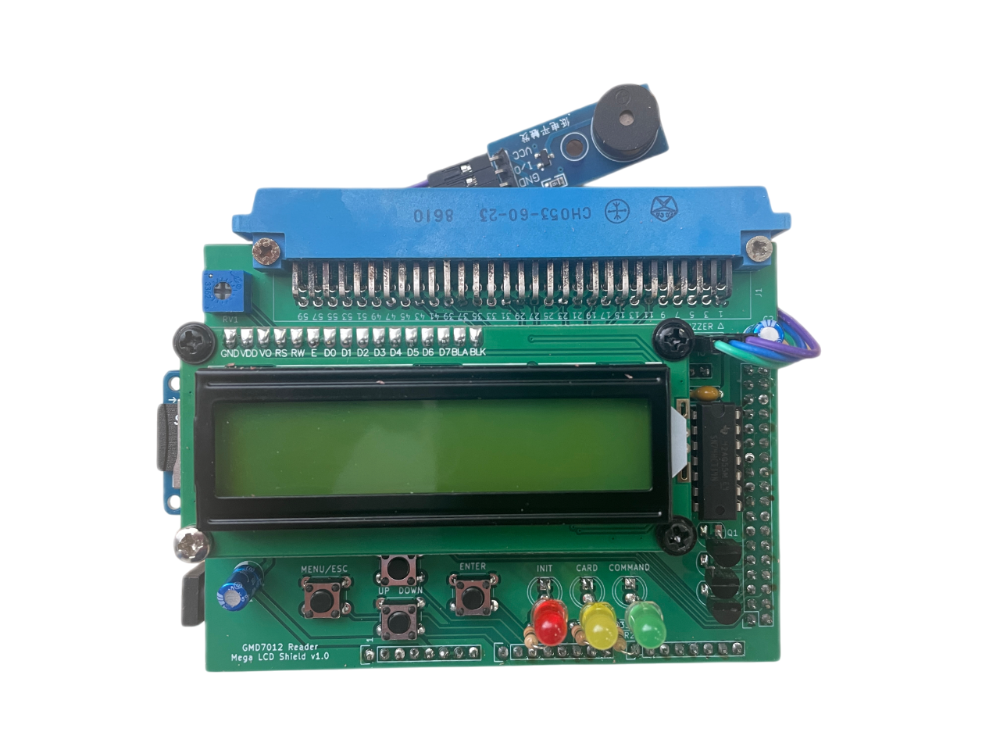
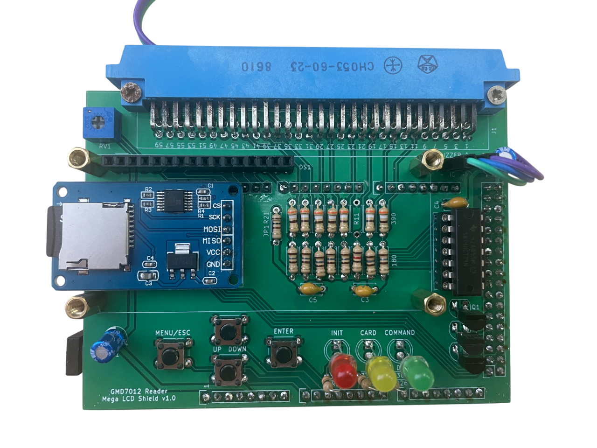
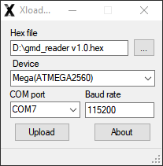

# Руководство по сборке считывателя для накопителя "ГМД-7012" (далее `READER`) #

## Сборка устройства

Для сборки устройства вам понадобиться:

1. Распаянная печатная плата устройства
2. Arduino Mega 2560 R3 (USB CH340)
3. Дисплей LCD 1602C без I2C
4. Адаптер для Micro SD Flash
5. Зуммер
6. MicroSD карта
7. Блок питания

## Где купить компоненты? ##

- Всю "рассыпуху" можно заказть в интернет-магазине ChipDip. Для удобства можно воспользоваться ссылкой на уже сформированную корзину. Количество компонентов расчитано на 10 печатных плат, если нужно меньше, то можно просто кратно уменьшить количество всех заказываемых позиций.  
[Корзина в ChipDip](https://www.chipdip.ru/cart/share/2VH5yriuXCz1h3LfwV9frz1fyJPbLA7jBDuQjtjyguGcRv8bEszTsHk1d4EooTHRyfYq3cdPZywZT95CQ4IUw855gfAyYqzsw3ijJ5LWnfdMUjMUVxApTBu0SUXfd2ztII).

- Arduino Mega 2560 R3 (USB CH340)  
    
  [Ozon](https://www.ozon.ru/search/?text=arduino+mega+2560+ch340)  
  [Wildberries](https://www.wildberries.ru/catalog/0/search.aspx?search=arduino+mega+2560+ch340)  

- LCD дисплей  
    
  [Ozon](https://www.ozon.ru/search/?text=LCD1602)  
  [Wildberries](https://www.wildberries.ru/catalog/0/search.aspx?search=LCD1602)  

- MicroSD адаптер  
    
  [Ozon](https://www.ozon.ru/search/?text=microsd+arduino)  
  [Wildberries](https://www.wildberries.ru/catalog/0/search.aspx?search=microsd+arduino)

- Зуммер  
    
  [Ozon](https://www.ozon.ru/search/?text=модуль+зуммера)  
  [Wildberries](https://www.wildberries.ru/catalog/0/search.aspx?search=модуль+зуммера)

- MicroSD карта  
  [Ozon](https://www.ozon.ru/search/?text=microsd+8gb)  
  [Wildberries](https://www.wildberries.ru/catalog/0/search.aspx?search=microsd+8gb)

- Блок питания  
  [Ozon](https://www.ozon.ru/search/?text=блок+питания+9V)  
  [Wildberries](https://www.wildberries.ru/catalog/0/search.aspx?search=блок+питания+9V)

## Печатная плата ##

Вы можете скачать [Gerbers](../pcb/GMD7012-reader-mega-shield_for_NextPCB_v1.0.zip) и заказать изготовление плат на производстве (Резонит, JLCPCB, NextPCB ...). Это стандартная 2-ух слойная плата, медь 1oz (35 мкм),  размеры платы меньше 100mm x 100mm, что позволяет заказывать данные платы со значительной скидкой, т.к. многие фабрики предоставляют существенные скидки на изготовление печатных плат с такими параметрами. 

## Монтаж печатной платы ##

[Схема электрическая принципиальная](<Электрическая схема v1.1.pdf>)  
[Интерактивный список материалов (BOM)](bom/ibom.html)  

Плата предполагает выводной монтаж. Это сделано чтобы не предъявлять особых требований к умению человека, который будет запаивать компоненты на плату.

**Таблица установленных резисторов R1-R16**

| Сигнал         | Резистор | Значение, Ом | Резистор | Значение, Ом |
| -------------- | -------- | ------------ | -------- | ------------ |
| RX_OUT_L       | R2       | **180**      | R1       | **390**      |
| RX_SHIFT_L     | R4       | **180**      | R3       | **390**      |
| RX_DATA_L      | R6       | **180**      | R5       | **390**      |
| RX_DONE_L      | R8       | **180**      | R7       | **390**      |
| RX_XFER_RQST_L | R10      | **180**      | R9       | **390**      |
| RX_INIT_L      | R12      | **120**      | R11      | -            |
| RX_ERROR_L     | R14      | **180**      | R13      | **390**      |
| RX_RUN_L       | R16      | **180**      | R15      | **390**      |

На место перемычки *JP1 (R21)* запаивается резистор номиналом 100 Ом.

Светодиоды следует запаять так, чтобы остались длинные выводы, иначе при сборке в корпус они будут утоплены слишком глубоко.

Микросхема *U1* устанавливается на панель. Вместо микросхемы *U1 74HCT14*, может быть установлена 74AHCT14, 74HC14, 74AHC14. Микросхемы следующих серий лучше не устанавливать: 7414, 74LS14, 74ALS14, 74xx04.

## MicroSD, LCD и Buzzer ##

Для установки MicroSD адаптера потребуется выпаять родной коннектор установленный на плате, затем впаять вилку *PLS-6* в предусмотренное место на печатной плате и сверху запаять MicroSD адаптер. Следует соблюсти горизонтальность, иначе в последсвии будут проблемы по установке платы в корпус.

LCD дисплей устанавливается в 16-пиновый разъем *DS1* расположенный на печатной плате. По четырем сторонам устанавливаются стойки 11мм с разьбой М3 и фиксируется винтами.

Buzzer (динамик) подключается с помощью 3-х жильного провода мама-мама к разъему *J2*. Распиновка нанесена на шелкографии (левый - GND; центральный - IO; правый - +5V).

## Корпус ##

Можно распечатать на 3D-принтере. В папке [enclouse](../enclouse) находятся `STL` модели.
* Body - основная часть  
* Lid - нижняя крышка  
* Button - кнопки (4 шт. на один корпус)

Требуется установить поддержки в месте выреза под разъем подключения дисковода.

## Прошивка Arduino ##

- Установить [драйвер CH340](https://wch-ic.com/downloads/CH341SER_EXE.html)
- Подключить Arduino Mega 2560 к ПК
- Скачать утилиту для прошивки HEX файлов:
[xLoader](https://github.com/binaryupdates/xLoader/archive/refs/heads/master.zip)

1. Разархивировать скачанный архив на жесткий диск
2. Запустить *XLoader.exe*
2. Выбрать [HEX файл](<../binary/gmd_reader v1.0.hex>) с прошивкой
3. Выбрать *Device - Mega(ATMEGA2560)*
4. Выбрать *COM порт*
5. Установить *Baud rate - 115200*
6. Нажать кнопку Upload 

Если не получилось прошить, то рекомендуется ознакомится с материлами в интернете по [прошивке Arduino](https://www.google.com/search?q=прошивка+arduino+hex)

## Яркость LCD дисплея ##

После сборки устройства, при первом подключении, LCD экран будет светиться и ничего не отображать. С помощью отвертки, поворачивая подстроечный резистор *RV1*, необходимо добиться комфортного уровня яркости подсветки экрана.